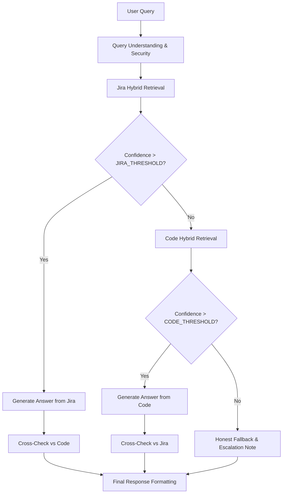

# Architecture

## The Cascade

```mermaid
graph TD
    A[User Query] --> B[Query Understanding & Security]
    B --> C[Jira Hybrid Retrieval]
    C --> D{Confidence > JIRA_THRESHOLD?}
    D -- Yes --> E[Generate Answer from Jira]
    D -- No --> F[Code Hybrid Retrieval]
    F --> G{Confidence > CODE_THRESHOLD?}
    G -- Yes --> H[Generate Answer from Code]
    G -- No --> I[Honest Fallback & Escalation Note]
    E --> J[Cross-Check vs Code]
    H --> K[Cross-Check vs Jira]
    J --> L[Final Response Formatting]
    K --> L
    I --> L
```
